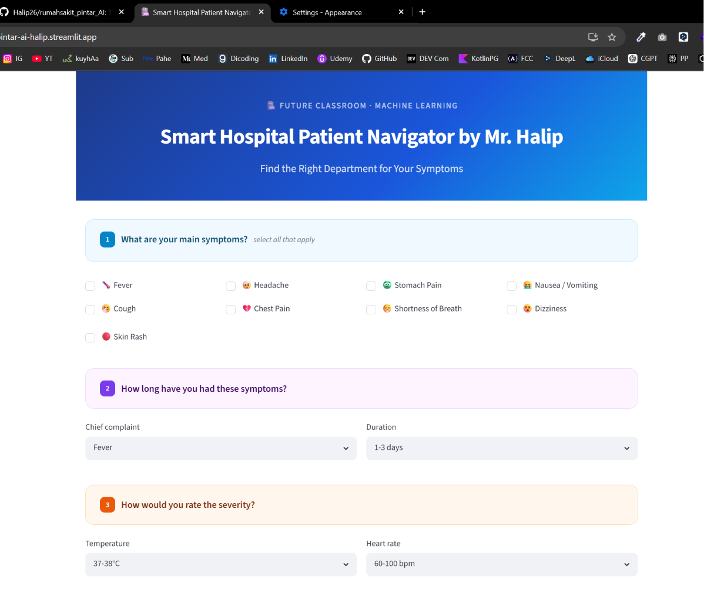

# Smart Hospital Patient Navigator

A simple Streamlit web app that helps users get a basic department recommendation based on symptoms, duration, severity, and medical history. It uses a pre-trained machine learning model stored in the repository and displays a friendly recommendation for the most relevant hospital department.



## What this app does

This project is a demo-style hospital triage assistant. The app collects a few inputs from the user, such as:

- symptoms (fever, cough, headache, chest pain, etc.)
- duration of symptoms
- temperature and heart rate level
- existing medical history such as hypertension, heart disease, or asthma
- age and gender

Then it uses a trained machine learning model to suggest the most likely department for the patient to visit.

> This app is for educational/demo purposes only and is not a medical diagnosis tool.

## Project files

- [hospital_app.py](hospital_app.py) — the main Streamlit app
- [requirements.txt](requirements.txt) — Python dependencies
- [assets/hospital_model_by_halip26.pkl](assets/hospital_model_by_halip26.pkl) — the pre-trained model bundle
- [assets/preview.png](assets/preview.png) — preview image for the README

## How it works

1. The user fills out the form in the Streamlit interface.
2. The app converts the input into a feature table.
3. The app loads the pre-trained model from the pickle file.
4. The model predicts the best department.
5. The app shows the recommended department, confidence, and next steps.

## Requirements

Make sure you have Python installed.

Recommended version:

- Python 3.10 or 3.11

## Step-by-step: run locally

### 1. Clone the repository

```bash
git clone https://github.com/Halip26/rumahsakit_pintar_AI.git
cd rumahsakit_pintar_AI
```

### 2. Create a virtual environment

On Windows:

```bash
python -m venv venv
venv\Scripts\activate
```

On macOS/Linux:

```bash
python3 -m venv venv
source venv/bin/activate
```

### 3. Install dependencies

```bash
pip install -r requirements.txt
```

### 4. Run the app

```bash
streamlit run hospital_app.py
```

Then open the local URL shown in the terminal, usually:

```text
http://localhost:8501
```

## Step-by-step: deploy to Streamlit Cloud

### 1. Upload the project to GitHub

Create a GitHub repository and push the project files there.

### 2. Open Streamlit Cloud

Go to:

https://streamlit.io/cloud

### 3. Sign in and create a new app

- Click New app
- Choose your GitHub repository
- Select the branch (usually main)
- Set the main file path to:

```text
hospital_app.py
```

### 4. Configure the app

Streamlit Cloud will automatically detect the Python app. Make sure:

- the repository contains [requirements.txt](requirements.txt)
- the app entry file is [hospital_app.py](hospital_app.py)
- the model file exists in [assets/hospital_model_by_halip26.pkl](assets/hospital_model_by_halip26.pkl)

### 5. Deploy

Click Deploy and wait for the app to build. Once it finishes, Streamlit Cloud will give you a public URL for your app.

## About the PKL file

The file [assets/hospital_model_by_halip26.pkl](assets/hospital_model_by_halip26.pkl) is a serialized machine learning model file.

It contains a pre-trained model bundle that includes:

- the trained classifier
- the scaler used for feature normalization
- the list of input features
- mapping dictionaries for categories such as gender, temperature, heart rate, duration, and chief complaint

Why it is used:

- the app needs a trained model to make predictions
- instead of retraining every time, the model is saved once and loaded when the app starts

Where it came from:

- this repository already includes the trained artifact in the assets folder
- it was created offline by training a scikit-learn model and saving the result with Python's pickle module
- because the training script/notebook is not included here, the app uses the provided pre-trained file directly

If you want to recreate it yourself, you would need a training dataset and a script that trains the model, then saves it with pickle in the same format.

## Troubleshooting

If the app does not start, try the following:

- make sure Python is installed correctly
- activate the virtual environment
- reinstall dependencies with:

```bash
pip install -r requirements.txt
```

- confirm the pickle file exists at:

```text
assets/hospital_model_by_halip26.pkl
```

## Notes

- The app is intended as a prototype and demo for learning purposes.
- It should not replace real medical advice or clinical judgment.
